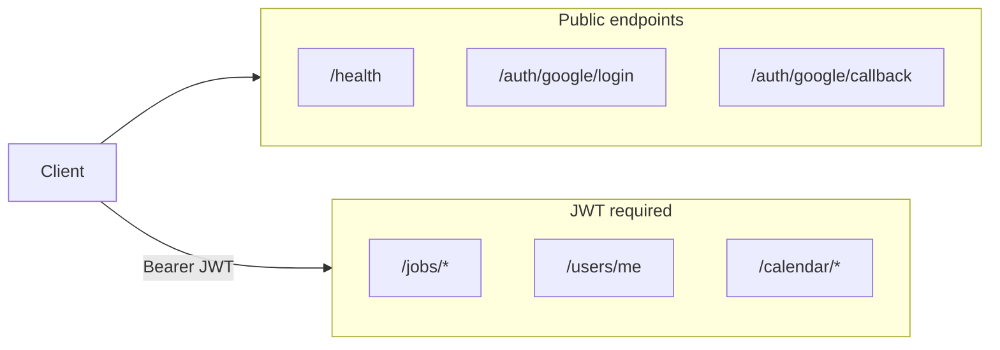
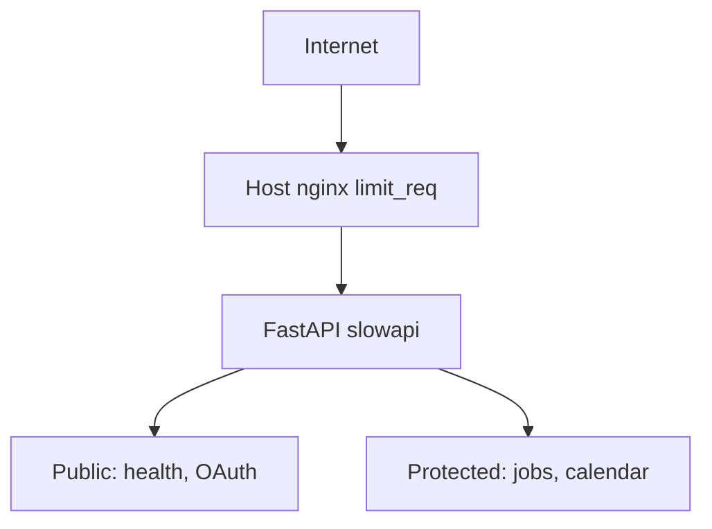

# API Rate Limiting and Endpoint Security

## Current state



**What is already good** ([`backend/app/dependencies.py`](backend/app/dependencies.py), [`backend/app/routers/jobs.py`](backend/app/routers/jobs.py)):
- All job/user/calendar routes require `get_current_user` (JWT Bearer)
- Per-user data scoping (`Job.user_id == user.id`)
- Google refresh tokens encrypted with Fernet ([`backend/app/services/encryption.py`](backend/app/services/encryption.py))
- CORS locked to `CORS_ORIGINS` ([`backend/app/main.py`](backend/app/main.py))

**Gaps to address:**

| Risk | Where | Impact |
|------|--------|--------|
| No rate limiting | Any endpoint | OAuth spam, ORS/Google API cost abuse, DoS |
| JWT in URL query | [`auth.py` callback](backend/app/routers/auth.py) → [`SweepsDashboard.tsx`](components/sweeps/SweepsDashboard.tsx) | Token leaks via logs, referrer, browser history |
| No OAuth `state` | [`/auth/google/login`](backend/app/routers/auth.py) | CSRF on OAuth flow |
| OpenAPI `/docs` default-on | FastAPI default | API surface exposed in production |
| 7-day JWT | `JWT_EXPIRE_MINUTES=10080` | Stolen token valid a long time |
| Expensive routes unthrottled | `/jobs/*/commute`, `/jobs/plan-route`, calendar | Each call hits ORS or Google Calendar |
| No signup gate (yet) | OAuth callback | Anyone with Google can connect until you add controls |

---

## Recommended architecture (two layers)



1. **nginx** (VPS, outside repo): coarse IP limits on `/auth/*` and global requests — protects the box even if the app is busy.
2. **slowapi** (in app): fine-grained per-route limits; per-user key on authenticated routes.

---

## Phase 1 — App security fixes (highest priority)

### 1.1 OAuth `state` + optional email allowlist (personal now, open later)

In [`backend/app/routers/auth.py`](backend/app/routers/auth.py):
- Generate cryptographically random `state`, store in short-lived signed cookie or server-side cache (Redis not needed — signed cookie with `SECRET_KEY` is enough for single-instance VPS).
- Validate `state` on `/auth/google/callback`.
- Add config in [`backend/app/config.py`](backend/app/config.py):

```python
allowed_emails: str = ""  # comma-separated; empty = allow any Google account
```

- After fetching Google userinfo in callback, if `allowed_emails` is non-empty, reject sign-in with `403` unless email is in the list.
- **Future:** leave env unset → open Google signup with no code change.

### 1.2 Stop passing JWT in URL

Replace redirect `?token=...` with one of:
- **Recommended:** redirect to `{frontend_url}/sweeps/auth/callback` with token in **URL hash** (`#token=...`) — hash is not sent to server logs or Referer headers.
- Add [`app/sweeps/auth/callback/page.tsx`](app/sweeps/auth/callback/page.tsx) client page that reads `window.location.hash`, calls `setAuthToken`, then `router.replace("/sweeps")`.
- Update backend redirect in `auth.py` accordingly.

### 1.3 Production app hardening in [`backend/app/main.py`](backend/app/main.py)

- `FastAPI(docs_url=None, redoc_url=None, openapi_url=None)` when `ENV=production` (new env var).
- Add `SecurityHeadersMiddleware` (or `starlette` middleware): `X-Content-Type-Options`, `X-Frame-Options`, `Referrer-Policy`, `Permissions-Policy`.
- Optional `TrustedHostMiddleware` with `api-jobs.tritechhelp.com` + `localhost` for dev.

### 1.4 Shorter JWT + refresh path (lightweight)

- Reduce default `JWT_EXPIRE_MINUTES` to **1440** (24h) in [`.env.example`](backend/.env.example); keep override in prod `.env`.
- No refresh-token endpoint yet (YAGNI for personal use); document re-login after expiry.

---

## Phase 2 — Rate limiting with slowapi

Add `slowapi` to [`backend/requirements.txt`](backend/requirements.txt).

Create [`backend/app/rate_limit.py`](backend/app/rate_limit.py):
- Shared `Limiter` keyed by `get_remote_address` for public routes.
- Helper `user_or_ip_key(request)` for protected routes: use JWT `sub` when present, else IP.

Wire in [`backend/app/main.py`](backend/app/main.py):
- `app.state.limiter = limiter`
- Register `RateLimitExceeded` → `429` handler.

Suggested limits (tune via env vars later):

| Route | Key | Limit | Why |
|-------|-----|-------|-----|
| `GET /health` | IP | 60/min | Monitoring scrapers |
| `GET /auth/google/login` | IP | 10/min | Block OAuth initiation spam |
| `GET /auth/google/callback` | IP | 20/min | Block callback flooding |
| `POST /jobs/*/commute` | user | 30/hour | ORS quota |
| `POST /jobs/plan-route` | user | 20/hour | ORS quota |
| `GET /calendar/events`, conflicts | user | 60/hour | Google Calendar quota |
| Default authenticated | user | 120/min | Normal dashboard use |

Apply via `@limiter.limit(...)` on route functions in [`auth.py`](backend/app/routers/auth.py) and [`jobs.py`](backend/app/routers/jobs.py).

**Note:** Behind nginx, ensure `proxy_set_header X-Real-IP $remote_addr` (and optionally `X-Forwarded-For`) so slowapi sees the real client IP — document in [`backend/docs/DEPLOYMENT.md`](backend/docs/DEPLOYMENT.md).

---

## Phase 3 — nginx gateway limits (VPS config, not in repo)

Add to the existing `api-jobs.tritechhelp.com` nginx site (on VPS):

```nginx
limit_req_zone $binary_remote_addr zone=sweeps_api:10m rate=10r/s;
limit_req_zone $binary_remote_addr zone=sweeps_auth:10m rate=5r/m;

location /auth/ {
    limit_req zone=sweeps_auth burst=5 nodelay;
    proxy_pass http://127.0.0.1:8000;
}
location / {
    limit_req zone=sweeps_api burst=20 nodelay;
    proxy_pass http://127.0.0.1:8000;
}
```

This is defense-in-depth; app-level limits still apply if nginx is bypassed.

---

## Phase 4 — Config and docs

Update [`backend/.env.example`](backend/.env.example):

```env
ENV=development
ALLOWED_EMAILS=you@example.com
# RATE_LIMIT_ENABLED=true  # optional kill switch
```

Update [`backend/docs/DEPLOYMENT.md`](backend/docs/DEPLOYMENT.md) with:
- Security env vars table
- nginx rate-limit snippet
- Reminder: `ALLOWED_EMAILS` empty = open signup

---

## Out of scope (for now)

- httpOnly cookie auth (bigger frontend/CORS change; hash fragment is sufficient)
- Redis-backed distributed rate limits (single VPS instance)
- WAF / Cloudflare (optional later for `api-jobs.tritechhelp.com`)
- Automated security tests beyond a couple of pytest cases for allowlist + 429 responses

---

## Verification checklist

- OAuth login rejected for non-allowlisted email when `ALLOWED_EMAILS` is set
- OAuth callback rejects missing/invalid `state`
- Token no longer appears in server access logs (hash-only on client)
- `/docs` returns 404 in production
- 11th rapid `/auth/google/login` from same IP → `429`
- Authenticated commute spam → `429` before ORS quota is exhausted
- `curl https://api-jobs.tritechhelp.com/health` still works for deploy checks
