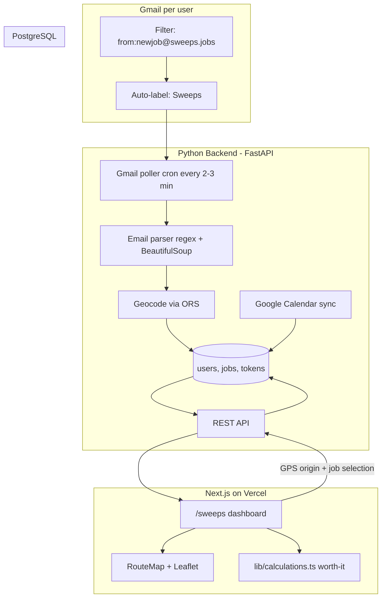

# Sweeps Email Automation Plan

## Recommended Architecture

**Split stack** — Python handles automation and Google APIs; Next.js handles the dashboard and reuses your existing map/routing/cost code.



### Why this split

| Layer | Choice | Reason |
|-------|--------|--------|
| Automation | **Python (FastAPI)** | Best Gmail/Calendar SDKs, cron-friendly, your preference |
| Dashboard | **Extend existing Next.js app** at `/sweeps` | Reuse [`lib/ors.ts`](lib/ors.ts), [`lib/calculations.ts`](lib/calculations.ts), [`components/RouteMap.tsx`](components/RouteMap.tsx), [`components/StopList.tsx`](components/StopList.tsx) — no second Vercel project needed |
| Email trigger | **Gmail label + API polling** | You only process labeled Sweeps mail; no inbound-mail service or domain required |
| Auth | **Google OAuth** | One consent flow covers sign-in, per-user Gmail read, and Calendar read/write |
| DB | **PostgreSQL** | Multi-user, job history, OAuth refresh tokens |

### Gmail label approach (your idea, refined)

Gmail cannot POST to a webhook directly. Your chosen path is the right one:

1. Each user creates a Gmail filter: `from:newjob@sweeps.jobs` → apply label `Sweeps`
2. On first login, your app guides them through this one-time setup
3. Python polls **only** `label:Sweeps` via Gmail API (not the whole inbox)
4. After successful parse, store `gmail_message_id` in the database to skip duplicates on future polls (Gmail labels are left unchanged)

This is cheap (a few API calls every few minutes per active user) and avoids parsing unrelated mail.

---

## Email Parsing (No LLM)

Sweeps emails have a fixed HTML table structure. Parse the **HTML part** with BeautifulSoup (more reliable than plain text with quoted-printable artifacts).

**Fields to extract** from your example:

| Field | Source | Example |
|-------|--------|---------|
| `category` | "Category" row | Yard Work |
| `details` | "Details" under What | Help dig a hole... |
| `sweepers_requested` | table cell | 1 |
| `start_at` | "Start At" row | 2026-07-01 11:00 AM |
| `duration_minutes` | parenthetical | 180 (from "3 hr duration estimate") |
| `flexible_time` | When/Details | true |
| `street`, `city_state`, `zip` | Location rows | Lead Mine Road / Raleigh, NC / 27612 |
| `job_url` | "View Job" link | extract Sweeps job ID from URL path |
| `gmail_message_id` | header | dedup key |
| `subject`, `received_at` | headers | audit trail |

**Parser implementation**: `backend/app/parsers/sweeps.py` with section-header anchors (`Job Poster`, `What`, `When`, `Where`) and regex for datetime (`Wednesday, 07/01/26 11:00AM`).

**Geocoding**: After parse, call OpenRouteService (same as [`lib/ors.ts`](lib/ors.ts)) from Python to get `lat/lng` for the full address string.

**Job pay**: Default **$20** per job in user profile (you indicated this is the Sweeps rate). Allow per-job override in the dashboard later.

---

## Data Model (PostgreSQL)

```sql
users
  id, google_sub, email, name
  gmail_refresh_token_encrypted
  calendar_refresh_token_encrypted  -- same Google OAuth token
  cost_settings JSONB               -- mirror CostSettings from types/index.ts
  default_job_pay DECIMAL DEFAULT 20
  travel_buffer_minutes INT DEFAULT 30

jobs
  id, user_id, gmail_message_id UNIQUE
  sweeps_job_id, category, details
  street, city_state, zip, full_address
  lat, lng
  start_at, duration_minutes, flexible_time
  job_url, status (new|considering|dismissed|expired)
  pay_amount
  -- cached commute metrics (recomputed on demand)
  drive_distance_miles, drive_duration_minutes, gas_cost, worth_it_mood
  parsed_at, expires_at

calendar_links
  job_id, google_event_id, event_status (tentative|confirmed)
```

**Auto-expire**: Cron sets `status = expired` where `start_at < now()` and status is still `new` or `considering`.

---

## API Design (FastAPI)

| Endpoint | Purpose |
|----------|---------|
| `POST /auth/google/callback` | OAuth, store tokens |
| `GET /jobs` | List jobs (filter by status, date) |
| `GET /jobs/{id}` | Job detail + fresh drive metrics |
| `PATCH /jobs/{id}` | Update status, pay override, dismiss |
| `POST /jobs/{id}/commute` | Compute drive from `origin_lat/lng` (browser GPS) → job, round-trip gas cost, worth-it |
| `POST /jobs/plan-route` | Multi-stop route through selected jobs (Phase 4) |
| `GET /calendar/events` | Events for a date range |
| `POST /jobs/{id}/calendar/tentative` | Create tentative GCal event (Phase 3) |
| `GET /calendar/conflicts` | Check job window + 30 min buffer vs calendar (Phase 2) |

Drive-time and cost logic mirrors [`calculateCosts`](lib/calculations.ts) and [`analyzeWorthIt`](lib/calculations.ts) — implement the same formulas in Python **or** have Next.js call existing client logic after fetching route data from the API.

---

## Dashboard UI (Next.js `/sweeps`)

Add to the existing app — same Vercel domain, shared nav link in [`components/SiteNav.tsx`](components/SiteNav.tsx).

### Phase 1 screens

1. **Onboarding** — Google sign-in → Gmail filter setup instructions → connect calendar (can defer calendar connect to Phase 2)
2. **Job inbox** — Cards/table: category, date/time, location, drive time + gas cost (from current GPS), worth-it badge, conflict indicator (Phase 2 placeholder)
3. **Job detail** — Full details, map pin, round-trip cost breakdown, dismiss / mark considering
4. **Map view** — All active jobs as pins; click pin → detail; distance rings from your current location

Reuse directly:
- [`RouteMap.tsx`](components/RouteMap.tsx) for pins and polylines
- [`lib/calculations.ts`](lib/calculations.ts) for cost/worth-it on the client
- Browser geolocation (already in [`LocationPickerModal.tsx`](components/LocationPickerModal.tsx)) for origin

### Later phases (already scoped)

| Phase | Features |
|-------|----------|
| **2** | Google Calendar read, 30-min travel buffer, conflict badges, worth-it includes schedule fit |
| **3** | Create tentative calendar events from job detail, job status workflow |
| **4** | Multi-job route planner (adapt [`StopList`](components/StopList.tsx) + dnd-kit), day planner timeline |

---

## Google Cloud Setup (one-time)

Create a Google Cloud project with:

- **OAuth 2.0 Client** (Web) — redirect URIs for Vercel + local dev
- **Scopes**: `openid email profile`, `gmail.readonly`, `calendar.events`
- **Gmail API** + **Google Calendar API** enabled
- OAuth consent screen: "Internal" if only you + friends, "External" if public multi-user (requires verification for sensitive scopes)

Store refresh tokens encrypted at rest (Fernet or DB-level encryption with `ENCRYPTION_KEY` env var).

---

## Hosting Options Comparison

You asked for options to compare — here are practical setups for this project:

| Option | Monthly cost | Best for | Tradeoffs |
|--------|-------------|----------|-----------|
| **A. Hybrid (recommended)** — Vercel (Next.js) + Railway (FastAPI + Postgres) | ~$5–15 | Lowest ops, good DX | Two platforms to manage |
| **B. Hetzner VPS** — Docker Compose: nginx + FastAPI + Postgres + optional Next.js | ~$4–6 (CX22) | Full control, cheapest at scale | You manage updates, backups, SSL |
| **C. Fly.io** — FastAPI + Postgres + Vercel frontend | ~$5–12 | Global edge, Docker | Slightly more config than Railway |
| **D. Free-tier max** — Vercel free + Supabase free Postgres + Render free cron | $0 | Experimentation | Render free tier sleeps; cold starts; not ideal for reliable 2-min polling |
| **E. All-in VPS** — Everything on one Hetzner box | ~$6–10 | Single bill, no Vercel | Lose Vercel CDN/preview deploys unless you self-host Next.js |

**Recommendation**: Start with **Option A** (Vercel + Railway). Move to **Option B** if you outgrow managed pricing or want everything on one machine. Avoid Option D for production polling reliability.

**Cron for Gmail polling**: Railway cron job or `APScheduler` inside FastAPI hitting Gmail every 2–3 minutes per user with active tokens.

---

## Project Structure

```
Commute_Calculator/
├── app/
│   └── sweeps/                    # NEW dashboard routes
│       ├── page.tsx               # Job inbox + map
│       ├── jobs/[id]/page.tsx     # Job detail
│       └── settings/page.tsx      # Cost settings, Gmail setup guide
├── lib/
│   ├── sweepsApi.ts               # NEW - fetch from Python backend
│   └── ... (existing ors, calculations, leaflet)
├── backend/                       # NEW Python service
│   ├── app/
│   │   ├── main.py
│   │   ├── parsers/sweeps.py
│   │   ├── services/gmail.py
│   │   ├── services/calendar.py
│   │   ├── services/geocode.py
│   │   ├── models/
│   │   └── routers/
│   ├── requirements.txt
│   └── Dockerfile
└── docker-compose.yml             # Local dev: Postgres + backend
```

---

## Security Notes

- OAuth tokens encrypted in DB; never log email bodies in production
- CORS: allow only your Vercel domain
- Per-user data isolation: all queries scoped by `user_id`
- Gmail scope is read-only (`gmail.readonly`) — cannot send/delete mail
- Rate-limit commute calculation endpoints to prevent ORS abuse

---

## Phase 1 Implementation Order

1. **Google Cloud project** + OAuth credentials
2. **Python backend scaffold** — FastAPI, Postgres, Alembic migrations, Docker
3. **Sweeps email parser** — unit tests with your example email as fixture
4. **Gmail service** — OAuth flow, label polling, dedup
5. **Job CRUD API** + geocoding on ingest
6. **Next.js `/sweeps`** — auth flow, job list, map, GPS-based commute calc
7. **Deploy** — Railway backend + existing Vercel app with `SWEEPS_API_URL` env var

Phases 2–4 follow once Phase 1 is stable.

---

## Key Decisions Already Made

- Python backend only; Next.js for UI
- Gmail label filtering + API polling (not full inbox, not raw webhook)
- Google OAuth for multi-user auth + per-user Gmail/Calendar
- Current GPS as drive origin (not fixed home)
- $20 default job pay for worth-it analysis
- 30-min travel buffer (Phase 2+)
- Tentative calendar events (Phase 3)
- No push notifications — dashboard is the check point
- Auto-expire past jobs + manual dismiss/status

## Open Item (minor)

You mentioned job pay is $20 — we'll use that as the profile default. If pay ever varies by job category, we can add per-job override in Phase 2 without changing the parser.
